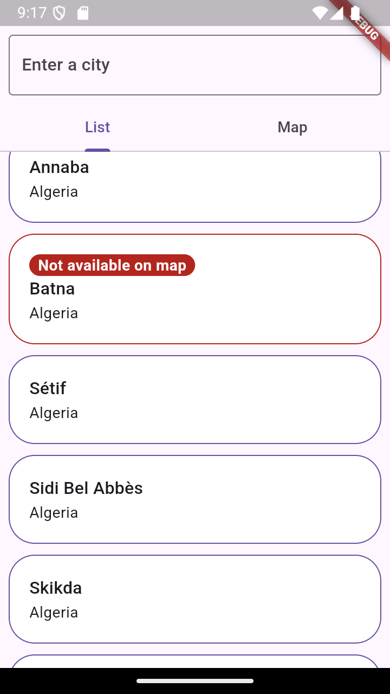
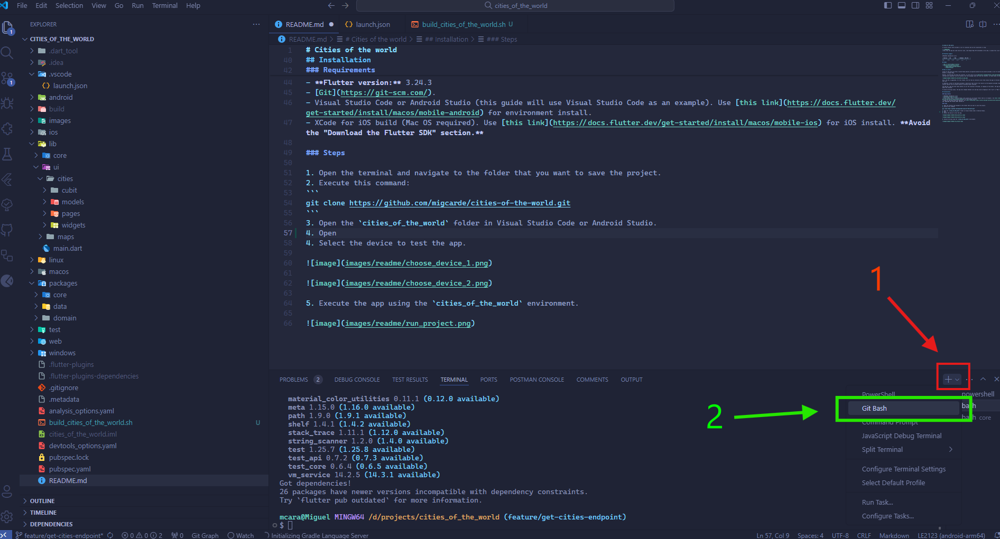
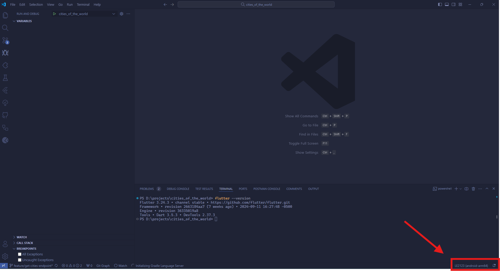
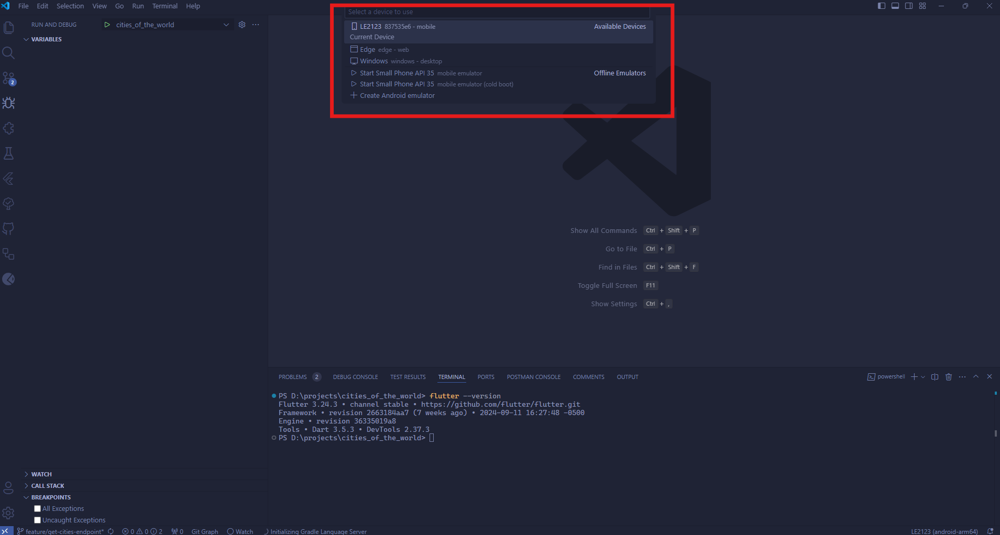
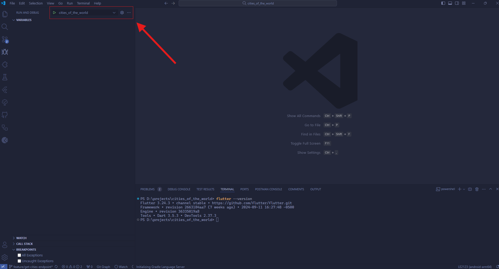

# Cities of the world

A flutter project that provides a list of locations and can be visualized in a map.

> [!IMPORTANT]
> Note that the app has some security risks, like Google Maps API hardcoded on the code, I assume this risk to make the installation easier.


## Platform support

**Flutter version:** 3.24.3

| Android  | iOS     | Web     | Windows | Mac OS   |
|:--------:|:-------:|:-------:|:-------:|:-------: |
| ✅       | ✅     | ❌      | ❌      | ❌      |

## Index

- [How it works?](#how-it-works)
- [Installation](#installation)
    - [Requirements](#requirements)
    - [Steps](#steps)

## How it works?

Cities of the world use http://connect-demo.mobile1.io/square1/connect/v1/city which provides a list of locations to show it as a list or set markers in Google Maps.

However, the API does not have any location, to solve this we use [geolocator package](https://pub.dev/packages/geolocator) that provides latitude and longitude from the location, but this package could not find the location. In these cases, we will inform the user in the list:



Also, the API is paginated, for this reason, the list has an infinite scroll that allows the app to retrieve data automatically at the end of the list.

In addition, Cities of the World provides a search bar that filters the results by the keywords provided. Besides, all searches (including the initial search) will be saved locally to provide faster searches.

The app has a map tab that shows markers on all the locations retrieved, on tapping on the marker, the app displays a dialog with information about the location.

To avoid scrolling issues, the app only changes between list and map view by tapping on the "List" or "Map" tabs.

## Installation

### Requirements

- **Flutter version:** 3.24.3
- [Git](https://git-scm.com/).
- Visual Studio Code or Android Studio (this guide will use Visual Studio Code as an example). Use [this link](https://docs.flutter.dev/get-started/install/macos/mobile-android) for environment install.
- XCode for iOS build (Mac OS required). Use [this link](https://docs.flutter.dev/get-started/install/macos/mobile-ios) for iOS install. **Avoid the "Download the Flutter SDK" section.**

### Steps

1. Open the terminal and navigate to the folder that you want to save the project.
2. Execute this command:
```
git clone https://github.com/migcarde/cities-of-the-world.git
```
3. Open the `cities_of_the_world` folder in Visual Studio Code or Android Studio.
4. Open a terminal
    1. **If you are in windows**, open bash instead of terminal.
    
    2. Execute this command:
    ```
    ./build_cities_of_the_world.sh
    ```
5. Select the device to test the app.





6. Execute the app using the `cities_of_the_world` environment.

